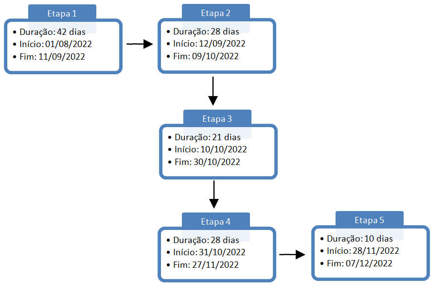

# Especificações do Projeto

A definição exata do problema e os pontos mais relevantes a serem tratados no projeto foi estabelecido com a participação dos usuários por meio de entrevista online com tópicos previamente estipulados. A partir dessa interação consolidamos os dados coletados na forma de personas e histórias de usuários.

## Personas

As pessoas retratadas durante o processo de compreensão do problema são apresentadas nas figuras que seguem.

Quadro 1 - Personas

| FOTO               | INFORMAÇÕES COLETADAS                                     |                     
|--------------------|-----------------------------------------------------------|
||**Sarah Arellano**    **Idade:** 30 anos |
| | **Ocupação:** Auxiliar de farmácia |
| | **Aplicativos:** _WhatsApp, Instagram_. |
| | **Motivações:**  Gosta muito de viajar.|
| | **Frustrações:** Não gosta de frequentar hotéis, pois não pode levar seus animais de estimação.|
| | **_Hobbies_, História:** Gosta de se exercitar na academia e ama viagens curtas.|

| FOTO               | INFORMAÇÕES COLETADAS                                     |                     
|--------------------|-----------------------------------------------------------|
| | **Emanuel Keese**    **Idade:** 52 anos |
| | **Ocupação:** Aposentado por invalidez |
| | **Aplicativos:** _WhatsApp_|
| | **Motivações:** Gosta de realizar as sessões de fisioterapia na praia, pois se sente motivado.|
| | **Frustrações:** Dificuldade em se deslocar de um lugar para o outro. Julgamento da sociedade em relação às pessoas com deficiência.|
| | **_Hobbies_, História:** Amava andar de moto e sofreu acidente de trânsito no qual perdeu um braço e uma perna (ambos do lado esquerdo).|

| FOTO               | INFORMAÇÕES COLETADAS                                     | 
|--------------------|-----------------------------------------------------------|
| | **Charles Stark**    **Idade:** 27 anos |
| | **Ocupação:** Estudante de nutrição  |
| | **Aplicativos:** _Linkedin, Instagram_, _WhatsApp_.|
| | **Motivações:** Conseguir atuar na área do esporte|
| | **Frustrações:** Não conseguir planejar as férias da faculdade |
| | **_Hobbies_, História:** Estudante de nutrição. Estagiário em um clube esportivo. Gosta de planejar com calma as férias da faculdade. |

| FOTO               | INFORMAÇÕES COLETADAS                                     |
|--------------------|-----------------------------------------------------------|
|| **Paola Avelar**    **Idade:** 29 anos 
| | **Ocupação:** Professora e mãe de dois filhos de 3 e 5 anos |
| | **Aplicativos:** _Youtube, Instagram_, _WhatsApp_.|
| | **Motivações:**  Agendar férias com a família em um local em que as crianças possam brincar.|
| | **Frustrações:** Dificuldade em encontrar locais de estadia com playground no local ou nas proximidades. |
| | **_Hobbies_, História:** Gosta de aproveitar o tempo livre com a família. Frequenta cinema e clube esportivo com regularidade.|

| FOTO               | INFORMAÇÕES COLETADAS                                     |                           
|--------------------|-----------------------------------------------------------|
|| **Ricardo Oliveira**    **Idade:** 20 anos 
| | **Ocupação:** Estudante EAD de jogos digitais|
| | **Aplicativos:** Jogos online, _Youtube, Instagram_, _WhatsApp_.|
| | **Motivações:**  Viajar com a família para um local com bom acesso a internet|
| | **Frustrações:** Não consegue coincidir férias da faculdade com as férias da família e, por isso procura locais com bom acesso a internet. |
| | **_Hobbies_, História:** Viaja regularmente com a família indo para sítios ou locais de pesca.|

| FOTO               | INFORMAÇÕES COLETADAS                                     |
|--------------------|-----------------------------------------------------------|
|| **Bruna Cintra**    **Idade:** 17 anos 
| | **Ocupação:** Estudante  | 
| | **Aplicativos:** _Youtube, Instagram_, _WhatsApp_. |
| | **Motivações:**  Gosta de viajar em grupo para locais onde possam curtir a natureza e praticar esportes radicais. |
| | **Frustrações:** Encontrar locais de esportes radicais próximos entre si. |
| | **_Hobbies_, História:** Viajar é o principal hobbie. Viaja com o seu grupo pelo o menos duas vezes ao ano.|

Fonte: Elaborado pelos autores

## Histórias de Usuários

Registramos as histórias de usuários no quadro abaixo, diante da informação coletada do dia a dia das personas identificadas para o projeto.Registramos as histórias de usuários no quadro abaixo, diante da informação coletada do dia a dia das personas identificadas para o projeto.

Quadro 2 - História de Usuários

|EU COMO... `PERSONA`                       | QUERO/PRECISO ... `FUNCIONALIDADE`                           |PARA ... `MOTIVO/VALOR`                                 |
|-------------------------------------------|--------------------------------------------------------------|--------------------------------------------------------|
|Sarah Arellano (Auxiliar de farmácia)      |Pesquisar informações sobre proibições e permissões no local. |Programar melhor as viagens com seus animais domésticos.|
|Emanuel Keese  (Aposentado por invalidez)  |Comparar informações sobre a estrutura dos imóveis.           |Encontrar o melhor imóvel no quesito acessibilidade.    |
|Charles Stark   (Estudante)                |Consultar disponibilidade dos imóveis.                        |Conseguir planejar o período de férias.                 |
|Paola Avelar (mãe de dois filhos pequenos) |Consultar a existência de playground no local ou nas proximidades. |Conseguir que as crianças tenham um local específico para brincarem.
|Ricardo Oliveira (Estudante EAD)           |Consultar a existência de acesso a internet no local.         |Estudar a noite e nos períodos de intervalo entre os passeios.|
|Bruna Cintra (Estudante)                   |Consultar os locais de esportes radicais nas proximidades do local de estadia. | Conseguir montar um roteiro de passeios com os amigos |

Fonte: Elaborado pelos autores

## Modelagem do Processo de Negócio (Etapa 2)

### Análise da Situação Atual (Etapa 2)

Apresente aqui os problemas existentes que viabilizam sua proposta. Apresente o modelo do sistema como ele funciona hoje. Caso sua proposta seja inovadora e não existam processos claramente definidos, apresente como as tarefas que o seu sistema pretende implementar são executadas atualmente, mesmo que não se utilize tecnologia computacional. 

### Descrição Geral da Proposta (Etapa 2)

Apresente aqui uma descrição da sua proposta abordando seus limites e suas ligações com as estratégias e objetivos do negócio. Apresente aqui as oportunidades de melhorias.

### Processo 1 – NOME DO PROCESSO (Etapa 2)

Apresente aqui o nome e as oportunidades de melhorias para o processo 1. Em seguida, apresente o modelo do processo 1, descrito no padrão BPMN. 

### Processo 2 – NOME DO PROCESSO (Etapa 2)

Apresente aqui o nome e as oportunidades de melhorias para o processo 2. Em seguida, apresente o modelo do processo 2, descrito no padrão BPMN.

## Indicadores de Desempenho (Etapa 2)

Apresente aqui os principais indicadores de desempenho e algumas metas para o processo. Atenção: as informações necessárias para gerar os indicadores devem estar contempladas no diagrama de classe. Colocar no mínimo 5 indicadores. 

Usar o seguinte modelo: 

Obs.: todas as informações para gerar os indicadores devem estar no diagrama de classe a ser apresentado a posteriori. 

## Requisitos

O propósito funcional do projeto é definido por meio dos requisitos funcionais que descrevem ações que o sistema deve estar apto a executar, assim como os requisitos não funcionais que descrevem os atributos que o sistema deve possuir de maneira geral. Estes requisitos são relacionados nas tabelas a seguir.

### Requisitos Funcionais

Apresentamos a seguir os requisitos funcionais que o projeto deverá atender.

Quadro 3 - Requisitos Funcionais

|ID    | Descrição do Requisito                                                                                                                    | Prioridade |
|------|-------------------------------------------------------------------------------------------------------------------------------------------|------------|
|RF-001| A aplicação deve permitir ao usuário realizar o cadastro.                                                                                 | ALTA       | 
|RF-002| A aplicação deve permitir ao usuário gerenciar seu cadastro.                                                                              | ALTA       |
|RF-003| A aplicação deve permitir ao usuário realizar a busca de imóveis através da funcionalidade de filtros como localidade ("cidade destino"). | ALTA       |
|RF-004| A aplicação deve disponibilizar um formulário de fale conosco para esclarecer dúvidas relacionadas ao _site_.                             | MÉDIA      |
|RF-005| A aplicação deve permitir ao usuário solicitar a redefinição de sua senha, informando o _e-mail_ cadastrado.                              | MÉDIA      |
|RF-006| A aplicação deve permitir que o usuário faça _login_ em sua conta através do seu _e-mail_ e senha cadastrados.                            | ALTA       |
|RF-007| A aplicação deve disponibilizar informações detalhadas quanto às características dos imóveis.                                             | ALTA       |
|RF-008| A aplicação deve permitir acesso à documentação de política de privacidade e termos e condições de uso.                                   | BAIXA      |
|RF-009| A aplicação deve permitir acesso às suas redes sociais.                                                                                   | BAIXA      |

Fonte: Elaborado pelos autores

### Requisitos não Funcionais

Apresentamos a seguir os requisitos não funcionais que o projeto deverá atender.

Quadro 4 - Requisitos Não Funcionais

|ID     | Descrição do Requisito                                                                                               |Prioridade |
|-------|----------------------------------------------------------------------------------------------------------------------|-----------|
|RNF-001| A aplicação deve ser compatível com os principais dispositivos e sistemas operacionais do mercado (_Android e IOS_). | ALTA      | 
|RNF-002| A aplicação deve ter bom nível de contraste entre os elementos da tela.                                              | MÉDIA     |
|RNF-003| A aplicação deve ser responsiva.                                                                                     | ALTA      |
|RNF-004| Para o desenvolvimento da aplicação devem ser utilizadas as linguagens, IDEs e _frameworks_ como: CSS3, JavaScript, React-Native, Json-Server e SQLite.| ALTA |
|RNF-005| A aplicação deve processar requisições do usuário em no máximo 10s.                                                  | MÉDIA     |
|RNF-006| A aplicação deve estar de acordo com LGPD (Lei Geral de Proteção de Dados).                                          | ALTA      |
|RNF-007| A aplicação deve estar disponível pelos menos 99% das 24 horas do dia, nos 07 dias da semana.                        | ALTA      |
|RNF-008| XXXXXXXXXXXXXXXXXXXX                                                                                                 | BAIXA     |

Fonte: Elaborado pelos autores

## Restrições

Apresentamos na tabela abaixo, tópicos consideráveis que limitam a execução do projeto e que se configuram como encargos necessários para seu desenvolvimento.

Quadro 5 - Restrições

|ID   | Restrição                                                                                                                |
|-----|--------------------------------------------------------------------------------------------------------------------------|
|RE-01| O projeto deverá ser entregue no final do semestre letivo, não podendo extrapolar a data de 07/12/2022.                  |
|RE-02| A equipe não pode subcontratar o desenvolvimento do trabalho.                                                            |
|RE-03| O aplicativo deve se restringir às tecnologias propostas pelo curso.                                                     |
|RE-04| A rotina de estudos da faculdade e do projeto deve se adequar e ser compartilhado com a família e o trabalho remunerado. |
|RE-05| A organização do projeto e do grupo deve possibilitar sua execução de forma assíncrona.                                  |
|RE-06| Não pode ser desenvolvido um módulo de _backend_                                                                         |

Fonte: Elaborado pelos autores

## Diagrama de Casos de Uso

O diagrama de caso de uso, comumente oriundo da especificação dos requisitos funcionais do sistema, descreve as principais funcionalidades do sistema que será projetado pelo grupo e sua interação com os possíveis usuários (DevMedia, 2022). Segundo Ivar Jacobson, podemos dizer que um caso de uso é um "documento narrativo que descreve a sequência de eventos de um ator que usa um sistema para completar um processo" (Wikipédia, 2020).

Graficamente é representado com elementos como os atores, os casos de uso e seus relacionamentos entre si. Seu objetivo principal é ilustrar de forma abstrata, a interação dos elementos externos com as funcionalidades do sistema, ou seja, “a finalidade de um diagrama de caso de uso é apresentar um tipo de diagrama de contexto que apresenta os elementos externos de um sistema e as maneiras segundo as quais eles as utilizam” (Wikipédia, 2020).

Desta feita, o grupo representa abaixo o diagrama de caso de uso para o sistema que será projetado.

Figura 1 - Diagrama de Casos de Uso

Fonte: Elaborado pelos autores

Quadro 6 - Casos de Uso

| ATOR         | DESCRIÇÃO                                                                      |
|--------------|--------------------------------------------------------------------------------|
| Usuário      | Pessoa interessada em alugar um imóvel de temporada.                           |
| Fale Conosco | Serviço disponibilizado pelo site para esclarecimento de dúvidas dos usuários. |

| CASO DE USO              | DESCRIÇÃO                                                                           | REQUISITO FUNCIONAL |
|--------------------------|-------------------------------------------------------------------------------------|---------------------|
| Esclarecer Dúvidas       | O usuário pode enviar formulário no Fale Conosco disponibilizado pela aplicação.    | RF-004 |
| Criar conta              | O usuário deve criar uma conta para utilizar os serviços oferecidos pela aplicação. | RF-001 |
| Alterar dados cadastrais | O usuário pode fazer alterações referentes ao seu cadastro pessoal.                 | RF-002 |
| Excluir conta            | O usuário pode excluir sua conta quando assim o desejar.                            | RF-002 |
| Fazer _login_            | O usuário deve fazer _login_ para acessar sua conta.                                | RF-006 |
| Redefinir senha          | O usuário pode redefinir sua senha se necessário.                                   | RF-005 |
| Buscar imóveis           | O usuário pode buscar e filtrar os imóveis disponíveis na aplicação.                | RF-003 |
| Visualizar as características dos imóveis | O usuário pode visualizar as características específicas de cada imóvel disponível para locação. | RF-007 |

| RELACIONAMENTO | DESCRIÇÃO                                                         |
|----------------|-------------------------------------------------------------------|
| INCLUSÃO       | Para fazer _login_, o usuário deve primeiro criar sua conta.      |
|                | Para alterar dados cadastrais, o usuário deve realizar o _login_. |
|                | Para excluir sua conta, o usuário deve realizar o _login_.        |
| EXTENSÃO       | Se o usuário esquecer sua senha ou preferir redefiní-la, poderá fazer informando seu _e-mail_ de cadastro. |

Fonte: Elaborado pelos autores

# Matriz de Rastreabilidade

A matriz de rastreabilidade é uma ferramenta usada para explicitar a relação e para facilitar a visualização desse relacionamento direto dos requisitos entre si ou com outros artefatos ou componentes do projeto. Com ela tonrna-se possível rastrear a origem dos requisitos, os elos que os ligam com outros elementos, encontrar inconsistências e garantir que os diferentes níveis do projeto estejam alinhados entre si (ESPINHA, 2022).

Nossa matriz contempla todos os requisitos funcionais e não funcionais que fazem parte do sistema, conforme a figura meramente ilustrativa apresentada a seguir.

Figura 1 - Matriz de Rastreabilidade

Fonte: Elaborado pelos autores

Veja [aqui](https://docs.google.com/spreadsheets/d/1MyE8Zmx_8N57_9V7qry-D7qlmqnQPI8S/edit#gid=724734350) nossa RTM completa.

# Gerenciamento de Projeto

De acordo com o PMBoK v6 as dez áreas que constituem os pilares para gerenciar projetos, e que caracterizam a multidisciplinaridade envolvida, são: Integração, Escopo, Cronograma (Tempo), Custos, Qualidade, Recursos, Comunicações, Riscos, Aquisições, Partes Interessadas. Para desenvolver projetos um profissional deve se preocupar em gerenciar todas essas dez áreas. Elas se complementam e se relacionam, de tal forma que não se deve apenas examinar uma área de forma estanque. É preciso considerar, por exemplo, que as áreas de Escopo, Cronograma e Custos estão muito relacionadas. Assim, se eu amplio o escopo de um projeto eu posso afetar seu cronograma e seus custos.

## Gerenciamento de Tempo

Com diagramas bem organizados que permitem gerenciar o tempo nos projetos, o gerente de projetos agenda e coordena tarefas dentro de um projeto para estimar o tempo necessário de conclusão. Abaixo o diagrama de rede simplificado:

O gráfico de Gantt ou diagrama de Gantt também é uma ferramenta visual utilizada para controlar e gerenciar o cronograma de atividades de um projeto. Com ele, é possível listar tudo que precisa ser feito para colocar o projeto em prática, dividir em atividades e estimar o tempo necessário para executá-las.

## Gerenciamento de Equipe

O gerenciamento adequado de tarefas contribuirá para que o projeto alcance altos níveis de produtividade. Por isso, é fundamental que ocorra a gestão de tarefas e de pessoas, de modo que os times envolvidos no projeto possam ser facilmente gerenciados. 

### Divisão de Papéis

Sua organização está apresentada conforme abaixo:

a) _Scrum Master_
  -	Fabiana Bicalho Palhano Rocha Cossenzo

b) _Product Owner_
   - Eduardo Lordeiro Alves

c) Equipe de Desenvolvimento
  -	Eduardo Lordeiro Alves
  -	Fabiana Bicalho Palhano Rocha Cossenzo
  -	Jaqueline Camara Poletto
  -	Nayara Katlin Oliveira da Silva

d) Equipe de _Design_ 
  -	Eduardo Lordeiro Alves
  -	Fabiana Bicalho Palhano Rocha Cossenzo
  -	Nayara Katlin Oliveira da Silva

## Gestão de Orçamento

Fonte: Elaborado pelos autores
