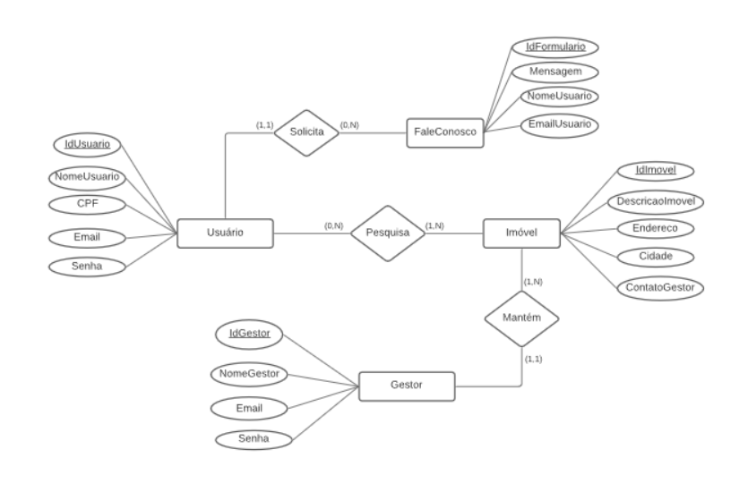

# 5. Arquitetura da Solução

A arquitetura de solução apresenta como o software é estruturado em termos dos componentes que fazem parte da solução e do ambiente de hospedagem da aplicação. Seguem abaixo os principais elementos relacionados a esse tópico.

## 5.1 Diagrama de Classes

(perguntar professor)

## 5.2 Modelo ER

O Modelo ER representa através de um diagrama como as entidades (coisas, objetos) se relacionam entre si na aplicação interativa. Segue abaixo a representação do Modelo ER:

Figura x - Modelo ER

Fonte: Elaborado pelos autores.

## 5.3 Esquema Relacional

O Esquema Relacional corresponde à representação dos dados em tabelas juntamente com as restrições de integridade e chave primária. Segue abaixo a representação do Esquema Relacional:

Figura y - Esquema Relacional

Fonte: Elaborado pelos autores

## 5.4 Diagrama de Componentes

Compreendemos nessa seção os componentes que fazem parte da arquitetura da solução, consoante figura adiante.

Figura z - Arquitetura da Solução

(inserir imagem)

Fonte: Elaborado pelos autores

A arquitetura da solução concretizada conta com os seguintes módulos:

- Navegador - Interface básica do sistema (adaptar)
   * Páginas Web - Conjunto de arquivos JavaScript, Bootstrap e imagens que efetivam as funcionalidades do sistema.
- Hospedagem - local na Internet onde as páginas serão mantidas e conectadas pelo navegador. 
   * Plataforma Azure
- Local Storage - armazenamento mantido no Navegador, onde são empreendidos bancos de dados baseados no JSON (JavaScript Object Notation).  
   * Dados do Hóspede
   * Dados do Cadastro do Imóvel
   * Dados da Reserva do Imóvel

## 5.5 Modelo Físico

Entregar um arquivo banco.sql contendo os scripts de criação das tabelas do banco de dados. Este arquivo deverá ser incluído dentro da pasta src\bd.

## 5.6 Tecnologias Utilizadas

Descreva aqui qual(is) tecnologias você vai usar para resolver o seu problema, ou seja, implementar a sua solução. Liste todas as tecnologias envolvidas, linguagens a serem utilizadas, serviços _web, frameworks_, bibliotecas, IDEs de desenvolvimento, e ferramentas.

Apresente também uma figura explicando como as tecnologias estão relacionadas ou como uma interação do usuário com o sistema vai ser conduzida, por onde ela passa até retornar uma resposta ao usuário.

- Linguagens e _frameworks_ utilizadas para desenvolver o projeto: JavaScript
- IDEs de desenvolvimento: Visual Studio Code e Expo
- Plataforma para hospedagem do site: Expo
- Plataforma para hospedagem dos arquivos: _GitHub e Google Drive_
- Ferramenta de versionamento: _Git e GitHub Desktop_
- Ferramenta para a criação de logo e imagens: Figma, CorelDraw
- Ferramenta para criação do _template / wireframe_: Figma e Adobe XD
- Ferramenta para criação de diagramas e fluxos: Lucidchart e Visio
- Banco de Dados: SQLite

## 5.7 Hospedagem

Explique como a hospedagem e o lançamento da plataforma foi feita.

> **Links Úteis**:
>
> - [Website com GitHub Pages](https://pages.github.com/)
> - [Programação colaborativa com Repl.it](https://repl.it/)
> - [Getting Started with Heroku](https://devcenter.heroku.com/start)
> - [Publicando Seu Site No Heroku](http://pythonclub.com.br/publicando-seu-hello-world-no-heroku.html)

## 5.8 Qualidade de Software

Conceituar qualidade de fato é uma tarefa complexa, mas ela pode ser vista como um método gerencial que através de procedimentos disseminados por toda a organização, busca garantir um produto final que satisfaça às expectativas dos stakeholders.

No contexto de desenvolvimento de software, qualidade pode ser entendida como um conjunto de características a serem satisfeitas, de modo que o produto de software atenda às necessidades de seus usuários. Entretanto, tal nível de satisfação nem sempre é alcançado de forma espontânea, devendo ser continuamente construído. Assim, a qualidade do produto depende fortemente do seu respectivo processo de desenvolvimento.

A norma internacional ISO/IEC 25010, que é uma atualização da ISO/IEC 9126, define oito características e 30 subcaracterísticas de qualidade para produtos de software.
Com base nessas características e nas respectivas sub-características, identifique as sub-características que sua equipe utilizará como base para nortear o desenvolvimento do projeto de software considerando-se alguns aspectos simples de qualidade. Justifique as subcaracterísticas escolhidas pelo time e elenque as métricas que permitirão a equipe avaliar os objetos de interesse.

> **Links Úteis**:
>
> - [ISO/IEC 25010:2011 - Systems and software engineering — Systems and software Quality Requirements and Evaluation (SQuaRE) — System and software quality models](https://www.iso.org/standard/35733.html/)
> - [Análise sobre a ISO 9126 – NBR 13596](https://www.tiespecialistas.com.br/analise-sobre-iso-9126-nbr-13596/)
> - [Qualidade de Software - Engenharia de Software 29](https://www.devmedia.com.br/qualidade-de-software-engenharia-de-software-29/18209/)
